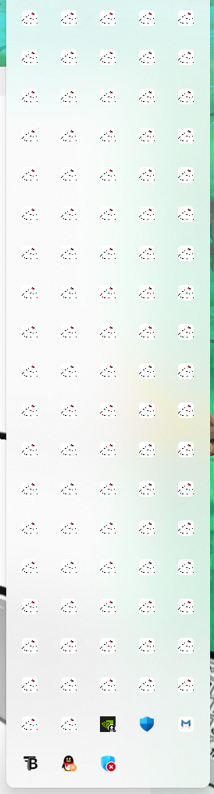

# My Pet Assistant 热更新方案

## 当前结论

当前仓库 **还不支持热更新**。

本地检查结果：

- `apps/desktop/package.json` 中还没有 `@tauri-apps/plugin-updater`
- `apps/desktop/src-tauri/Cargo.toml` 中还没有 `tauri-plugin-updater`
- `apps/desktop/src-tauri/tauri.conf.json` 中还没有 updater 配置
- 当前打包流程只会生成 `exe / msi / nsis` 安装包，不会生成 updater 所需的更新元数据与签名链路

## 目标

为 Windows 版桌宠助手增加一条稳定、可回滚、可灰度的自动更新能力，满足：

- 应用内可以检查新版本
- 用户确认后自动下载并安装
- 更新包有签名校验，避免被篡改
- 支持 `setup.exe` 安装版用户升级
- 后续可扩展到 macOS

## 推荐方案

基于 **Tauri 2 官方 Updater 插件**实现。

官方资料：

- Tauri 2 Updater 插件文档：<https://v2.tauri.app/zh-cn/plugin/updater/>

根据官方文档，Tauri 2 的标准做法是：

- 在前端通过 updater API 检查更新
- 打包时生成 updater artifacts
- 服务端提供带平台信息、版本号、下载地址和签名的更新清单
- 客户端校验签名后再安装

## 推荐架构

### 1. 客户端

桌面端新增 updater 能力：

- 启动后延迟检查更新
- 设置页提供“手动检查更新”
- 有新版本时显示更新弹窗
- 用户确认后下载并安装
- 下载失败时写入审计日志

建议入口：

- `apps/desktop/src/services/updater-client.ts`
- `apps/desktop/src/hooks/use-app-updater.ts`
- `apps/desktop/src/features/settings/update-card.tsx`

### 2. 发布产物

CI 在每次 release 时生成：

- `nsis setup.exe`
- `msi`
- updater metadata
- 签名文件

### 3. 更新源

MVP 推荐两种任选其一：

1. GitHub Releases
2. 对象存储/CDN

MVP 更推荐 `GitHub Releases`，因为最省事。

原因：

- 现成版本管理
- 现成文件托管
- 适合早期单人/小团队发布

后期如果下载量变大，再切到对象存储即可。

## 实施步骤

### 第一阶段：接入基础更新能力

1. 前端安装 `@tauri-apps/plugin-updater`
2. Rust 安装 `tauri-plugin-updater`
3. 在 `src-tauri` 中注册 updater plugin
4. 在 `tauri.conf.json` 中补充 updater 配置
5. 在打包流程中开启 updater artifacts 生成

### 第二阶段：前端交互

增加以下体验：

- 启动后 10 到 20 秒静默检查
- 设置页“检查更新”按钮
- 有新版本时显示版本号、更新说明、文件大小
- 下载中显示进度
- 下载完成后允许“立即安装并重启”

### 第三阶段：发布链路

在 GitHub Actions 中增加：

- Windows 打包
- 生成 updater 所需文件
- 上传到 Release
- 发布版本说明

### 第四阶段：安全与回滚

补充：

- updater 签名私钥管理
- 发布失败时保留旧版本下载入口
- 新版本异常时允许用户重新安装上一版本

## 我们项目里的建议落点

### 前端

- `apps/desktop/src/services/updater-client.ts`
  - 封装 `check`, `download`, `install`
- `apps/desktop/src/hooks/use-app-updater.ts`
  - 管理检查中、下载中、可安装等状态
- `apps/desktop/src/app/settings/page.tsx`
  - 增加“版本与更新”区域

### Rust

- `apps/desktop/src-tauri/Cargo.toml`
  - 增加 updater plugin
- `apps/desktop/src-tauri/src/lib.rs`
  - 注册 updater plugin
- `apps/desktop/src-tauri/tauri.conf.json`
  - 增加 updater 配置

### 文档与运维

- `docs/release-process.md`
  - 记录如何发版
- `docs/hot-update-plan.md`
  - 当前这份方案文档

## UI 建议

更新提示不要做成打断式大弹窗，建议分三层：

- 静默检查中：不提示
- 检查到新版本：右下角轻提示 + 设置页红点
- 用户点击更新：再进入确认弹窗

这样不会打断桌宠主体验。

## 审计与日志

建议把更新行为也写进现有日志体系：

- `check_update`
- `download_update`
- `install_update`
- `rollback_update`

记录字段建议包含：

- 当前版本
- 目标版本
- 下载地址
- 开始时间
- 完成时间
- 结果
- 错误信息

## 风险点

### 1. 私钥管理

如果 updater 私钥泄露，攻击者可以伪造升级包。

建议：

- 私钥只放 CI Secret
- 本地开发不要保存正式私钥

### 2. 桌宠正在运行中的升级体验

升级前要先退出 pet window、主窗口和后台进程，避免文件占用。

### 3. agent-service 版本兼容

后续如果 `desktop` 和 `agent-service` 绑定版本，需要定义兼容策略：

- 同步发布
- 或者桌面端内置兼容层

MVP 阶段更建议同步发布。

## MVP 版本的最省事做法

如果我们下一步就做热更新，建议按这个顺序：

1. 只支持 Windows
2. 只支持正式 release 检查更新
3. 更新源先用 GitHub Releases
4. 只做“发现新版本 -> 下载 -> 安装重启”
5. 灰度发布、差分包、回滚 UI 放到第二期

## 验收标准

做到下面这些，就算第一版热更新可用：

- 已安装旧版的用户可以在应用内检查到新版本
- 能看到新版版本号和更新说明
- 能下载并完成安装
- 安装后自动进入新版本
- 更新失败不会破坏现有安装

## 下一步开发任务

建议在任务看板里新增以下条目：

1. 接入 Tauri updater plugin
2. 设计更新状态机与前端提示
3. 新增设置页“版本与更新”
4. 配置 GitHub Releases 发布流
5. 增加更新日志与失败兜底

## 参考

- Tauri 2 Updater 插件文档：<https://v2.tauri.app/zh-cn/plugin/updater/>
